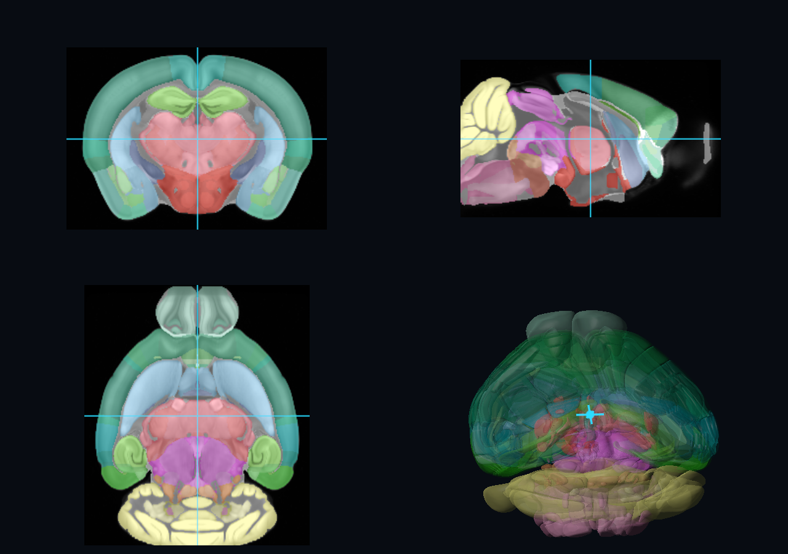
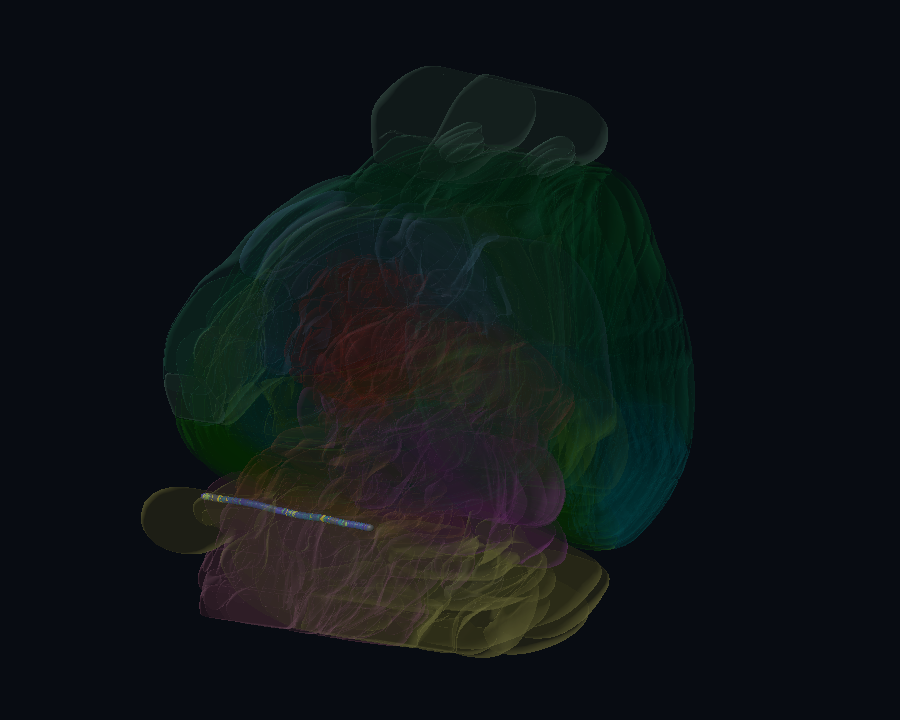
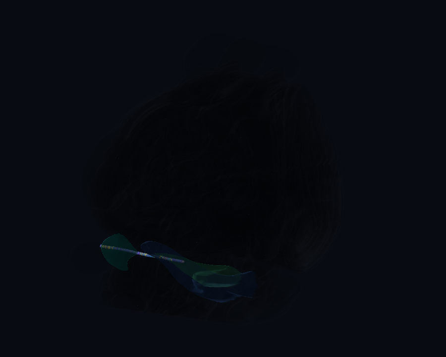

# Gallery

These examples are executable checkpoints, not static mock-ups. Capability labels distinguish
what works in the current native renderer from future browser exports.

<div class="gallery-grid" markdown>

<div class="gallery-card" markdown>

## Linked atlas navigator



<span class="capability capability--native">Native · available</span>
<span class="capability capability--data">D070 + Allen 50 um volumes</span>

Three orthogonal anatomical/annotation slices share one AP/ML/DV cursor with the D070 surface,
scalar template volume, ontology tree, mapping selector, and linked selections. Slice clicks and GUI
sliders update every panel; Allen, Beryl, and Cosmos retain their official colors.

The same entry accepts an optional exact 10 um slice source while retaining the 50 um dense 3-D volume. Those assets are deliberately not a gallery default until their immutable publication location exists; the renderer never uploads the complete 10 um volume.

```bash
python examples/linked_atlas_navigator.py \
  ../ibl-anatomy/build/d070-published/mesh-pack \
  ../ibl-anatomy/build/allen-ccf-2017-50um \
  --ui-scale 1.5
```

</div>

<div class="gallery-card" markdown>

## BWM probe sites



<span class="capability capability--native">Native · available</span>
<span class="capability capability--webgpu">WebGPU · candidate</span>

One real insertion with a translucent WBOIT anatomy shell, probe trajectory, 192 channel groups,
missing-value styling, and a linked searchable table.

```bash
python examples/bwm_probe.py build/atlas-d070 --mapping beryl
```

</div>

<div class="gallery-card" markdown>

## Regional BWM activity



<span class="capability capability--native">Native · available</span>
<span class="capability capability--webgpu">WebGPU · candidate</span>

The same record aggregated by signed Allen region, then explicitly reduced for Beryl or Cosmos.
Selection links valued surfaces, sites, ontology rows, and both retained tables.

```bash
python examples/bwm_region_activity.py build/atlas-d070 --mapping beryl
```

</div>

<div class="gallery-card" markdown>

## Allen atlas explorer

<span class="capability capability--native">Native · available</span>
<span class="capability capability--webgpu">WebGPU · candidate</span>

Verified D070 geometry, official ontology colors, Allen/Beryl/Cosmos switching, arcball camera,
face picking, and an optional synthetic probe used to test linked selection.

```bash
python examples/allen_mouse_brain.py build/atlas-d070 --demo-probe
```

</div>

<div class="gallery-card" markdown>

## Offline contract smoke test

<span class="capability capability--native">Native · available</span>
<span class="capability capability--webgpu">WebGPU · portability spike</span>
<span class="capability capability--data">Synthetic fixture</span>

A small network-free mesh and region catalog for fast rendering and lifecycle checks. Its second
rung includes the retained ontology, linked selection, and the same centroid-based region explosion
used by ephys-atlas-web-v2. It carries no scientific claim.

```bash
python examples/atlas_spike.py \
  ../ibl-anatomy/tests/fixtures/mesh-pack-v1/pack \
  --regions ../ibl-anatomy/tests/fixtures/atlas-regions-v1/regions.json
```

</div>

</div>

## Diagnostic benchmark

`examples/benchmark_atlas.py` verifies the real asset graph, measures decoding and mapping
preparation, optionally renders a frame, and records face-query timings. Its generated PNG and JSON
remain build-local because timing and pixels depend on the host.

`tools/benchmark_region_updates.py` isolates the retained update path used when a complete regional
payload changes. For example:

```bash
python tools/benchmark_region_updates.py build/atlas-d070 \
  --mapping allen --iterations 20 --json build/region-update-benchmark.json
```

`tools/benchmark_atlas_3d.py` runs the isolated 3-D feature ladder in fresh processes. It uses
Datoviz's native frame instrumentation with immediate presentation, separates Python mutation time,
and compares the opaque baseline with rotation, interaction/query capabilities, GUI embedding,
hover/selection emphasis updates,
and static or animated explosion:

```bash
python tools/benchmark_atlas_3d.py \
  ../ibl-anatomy/build/d070-published/mesh-pack \
  --regions ../ibl-anatomy/build/d070-published/regions.json \
  --json build/atlas-3d-benchmark.json
```

See [the D070 findings](../ATLAS_3D_BENCHMARK_FINDINGS.md) for the current measurements,
limitations, and follow-up microbenchmarks.

`examples/benchmark_registered_slices.py` measures cold indexed-block decode, exact registered annotation rasterization, mapping-aware boundary extraction, warm cache reuse, and retained cache bytes for all three orthogonal 10 um planes. Reports remain local because source publication and host performance are independent concerns.

## Capability matrix

| Entry | Native | Offscreen | WebGPU |
| --- | --- | --- | --- |
| Linked atlas navigator | Available | Available | Not available: volume visual is native-only |
| Offline contract smoke test | Available | Available | C/WASM portability spike |
| Allen atlas explorer | Available | Available | Candidate; not exported |
| BWM probe sites | Available | Available | Candidate; not exported |
| Regional BWM activity | Available | Available | Candidate; not exported |
| D070 diagnostic benchmark | Available | Available | Not applicable |

## WebGPU status

Datoviz now has a deliberately narrow `lab_ibl_atlas_webgpu_spike` scenario built from the same
miniature renderer-neutral fixture semantics as the offline smoke test. One C scene supplies both
the native runner and the WebGPU/WASM route. Automated checks cover its opaque indexed mesh, four
probe sites colored from signed identities, and arcball updates.

This is a portability proof, not an export of the Python application. It deliberately does not
claim parity for the retained atlas tree and tables, dataset transport, picking, or WBOIT. The two
BWM scenes remain useful next candidates, but a browser implementation must state how it replaces
native WBOIT before its output is presented as equivalent.

From an adjacent Datoviz checkout, the development route is:

```text
examples/webgpu/examples.html?demo=wasm-ibl-atlas-spike
```

See [Development](../development.md#regenerate-the-gallery) for the single-command gallery pipeline.
