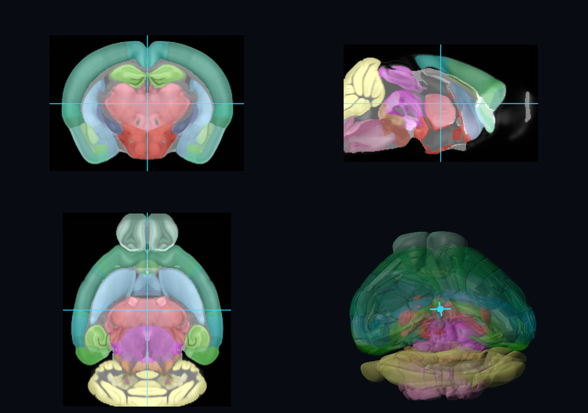
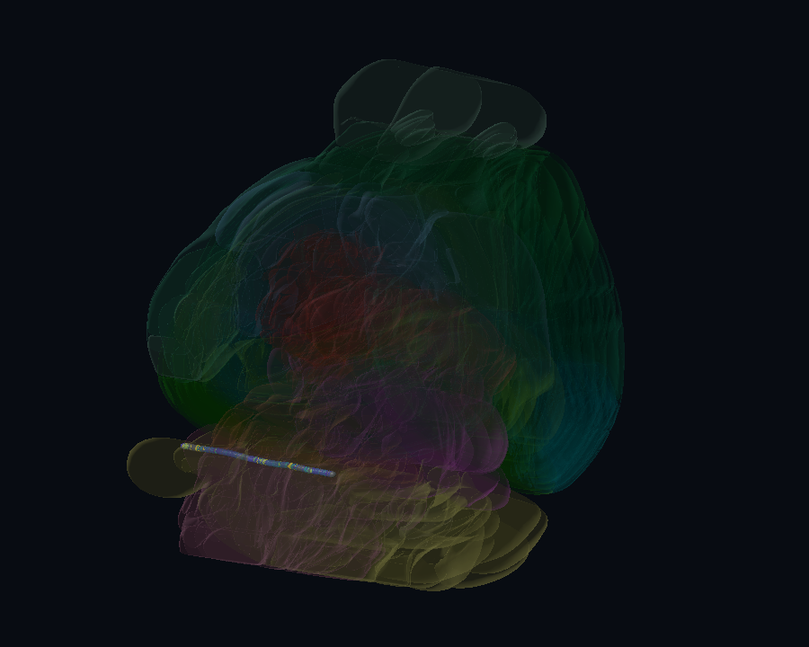
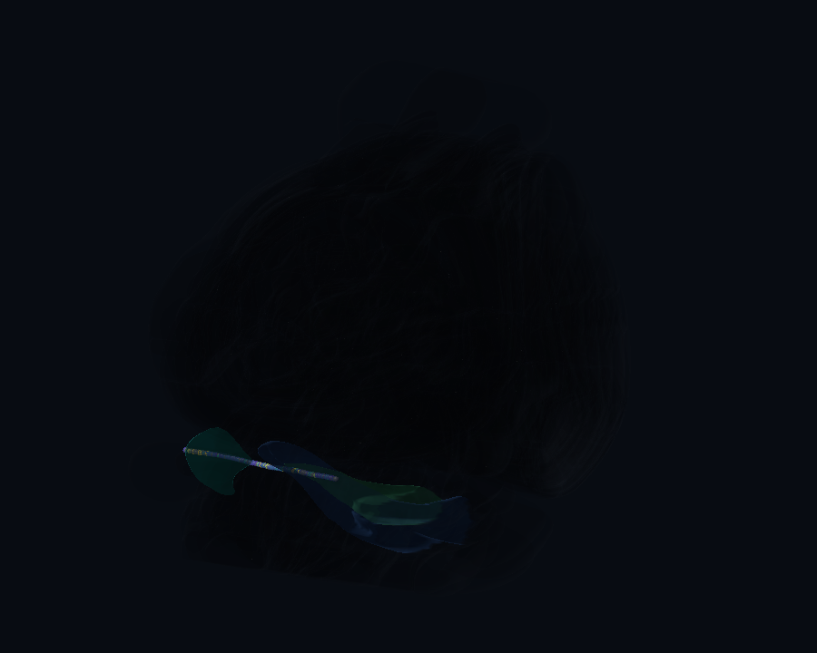

# Gallery

These examples are executable checkpoints, not static mock-ups. Capability labels distinguish
what works in the current native renderer from future browser exports.

## Focused review batch

Six small programs isolate the first interaction vocabulary before it is composed into the linked
navigator. They are review candidates rather than accepted showcase images:

| Program | One capability | Data |
| --- | --- | --- |
| `real_atlas_surface.py` | orbit one surface | verified D070 asset set |
| `atlas_mapping_switch.py` | switch Allen/Beryl/Cosmos | verified D070 catalog and mesh |
| `atlas_region_picking.py` | hover/select one region | D070 face identities |
| `bwm_probe_geometry.py` | inspect trajectory and sites | pinned BWM insertion fixture |
| `bwm_probe_firing_rate.py` | inspect sequential site values and missing data | pinned BWM insertion fixture |
| `atlas_slice_scroll.py` | scroll one AP/ML/DV plane | verified 50 um volume pack |

Every program opens an interactive native window by default and accepts `--offscreen PNG` for a
deterministic review artifact. The gallery manifest records reproducible commands; no image is
promoted here until its interaction and visual encoding have been reviewed live.

<div class="gallery-grid" markdown>

<div class="gallery-card" markdown>

## Linked atlas navigator



<span class="capability capability--native">Native · available</span>
<span class="capability capability--data">D070 + Allen 50 um volumes</span>

Three orthogonal anatomical/annotation slices share one AP/ML/DV cursor with the D070 surface,
scalar template volume, ontology tree, mapping selector, and linked selections. Slice clicks and GUI
sliders update every panel; Allen, Beryl, and Cosmos retain their official colors.

The same entry accepts an optional exact 10 um slice source while retaining the 50 um dense 3-D volume. The exact registered geometry is published; the intensity transport is built locally as described in [Getting started](../getting-started.md#build-the-volume-and-intensity-packs). These larger assets are optional gallery inputs; the renderer never uploads the complete 10 um volume.

```bash
uv run --frozen python examples/linked_atlas_navigator.py \
  build/atlas-d070/mesh-pack \
  build/allen-ccf-2017-50um \
  --ui-scale 1.5
```

</div>

<div class="gallery-card" markdown>

## BWM probe sites



<span class="capability capability--native">Native · available</span>
<span class="capability capability--webgpu">WebGPU · candidate</span>

One real insertion with a translucent WBOIT anatomy shell, probe trajectory, 192 channel groups,
missing-value styling, and a linked searchable table.

```bash
uv run --frozen python examples/bwm_probe.py build/atlas-d070 --mapping beryl
```

</div>

<div class="gallery-card" markdown>

## Regional BWM activity



<span class="capability capability--native">Native · available</span>
<span class="capability capability--webgpu">WebGPU · candidate</span>

The same record aggregated by signed Allen region, then explicitly reduced for Beryl or Cosmos.
Selection links valued surfaces, sites, ontology rows, and both retained tables.

```bash
uv run --frozen python examples/bwm_region_activity.py build/atlas-d070 --mapping beryl
```

</div>

<div class="gallery-card" markdown>

## Allen atlas explorer

<span class="capability capability--native">Native · available</span>
<span class="capability capability--webgpu">WebGPU · candidate</span>

Verified D070 geometry, official ontology colors, Allen/Beryl/Cosmos switching, arcball camera,
face picking, and an optional synthetic probe used to test linked selection.

```bash
uv run --frozen python examples/allen_mouse_brain.py build/atlas-d070 --demo-probe
```

</div>

<div class="gallery-card" markdown>

## Offline contract smoke test

<span class="capability capability--native">Native · available</span>
<span class="capability capability--webgpu">WebGPU · historical proof</span>
<span class="capability capability--data">Synthetic fixture</span>

A small network-free mesh and region catalog for fast rendering and lifecycle checks. Its second
rung includes the retained ontology, linked selection, and the same centroid-based region explosion
used by ephys-atlas-web-v2. It carries no scientific claim.

```bash
uv run --frozen python examples/atlas_spike.py \
  build/anatomy-tools/tests/fixtures/mesh-pack-v1/pack \
  --regions build/anatomy-tools/tests/fixtures/atlas-regions-v1/regions.json
```

</div>

</div>

## Diagnostic benchmark

`examples/benchmark_atlas.py` verifies the real asset graph, measures decoding and mapping
preparation, optionally renders a frame, and records face-query timings. Its generated PNG and JSON
remain build-local because timing and pixels depend on the host.

`tools/benchmark_region_updates.py` isolates the retained update path used when a complete regional
payload changes. For example:

```bash
uv run --frozen python tools/benchmark_region_updates.py build/atlas-d070 \
  --mapping allen --iterations 20 --json build/region-update-benchmark.json
```

`tools/benchmark_atlas_3d.py` runs the isolated 3-D feature ladder in fresh processes. It uses
Datoviz's native frame instrumentation with immediate presentation, separates Python mutation time,
and compares the opaque baseline with rotation, interaction/query capabilities, GUI embedding,
hover/selection emphasis updates, real and burst pointer movement, empty and populated embedded
viewports, small and complete ontology trees, and static or animated explosion:

```bash
uv run --frozen python tools/benchmark_atlas_3d.py \
  build/atlas-d070/mesh-pack \
  --regions build/atlas-d070/regions.json \
  --json build/atlas-3d-benchmark.json
```

See [the D070 findings](../ATLAS_3D_BENCHMARK_FINDINGS.md) for the dated measurements,
limitations, and follow-up microbenchmarks.

`tools/benchmark_atlas_2d.py` isolates the retained native cost of one 50 um slice. Its layer ladder
adds linear-sampled anatomy, nearest-sampled annotation, mapping-aware vector boundaries, and the
cursor crosshair in fresh processes:

```bash
uv run --frozen python tools/benchmark_atlas_2d.py \
  build/allen-ccf-2017-50um \
  --json build/atlas-2d-50um.json
```

See [the 2-D findings](../ATLAS_2D_BENCHMARK_FINDINGS.md) for the dated measurements.
`examples/benchmark_registered_slices.py` separately measures cold indexed-block decode, exact
registered annotation rasterization, mapping-aware boundary extraction, warm cache reuse, and
retained cache bytes for all three orthogonal 10 um planes. Reports remain local because source
publication and host performance are independent concerns.

## Capability matrix

| Entry | Native | Offscreen | WebGPU |
| --- | --- | --- | --- |
| Focused review batch | Available | Available | Candidate except native volume slice |
| Linked atlas navigator | Available | Available | Not available: volume visual is native-only |
| Offline contract smoke test | Available | Available | Historical proof; absent from baseline |
| Allen atlas explorer | Available | Available | Candidate; not exported |
| BWM probe sites | Available | Available | Candidate; not exported |
| Regional BWM activity | Available | Available | Candidate; not exported |
| D070 diagnostic benchmark | Available | Available | Not applicable |

## WebGPU status

An earlier development checkout demonstrated a narrow C/WASM scene named
`lab_ibl_atlas_webgpu_spike`, with a browser route named `wasm-ibl-atlas-spike`.
This is historical portability evidence. Neither entry exists in the frozen Datoviz main baseline
`066a7451195b38c5e95dcf7af7383b89ec5ec903`; it is not a current reproduction route.

The supported reproduction route for this package is the native Python offline contract smoke
shown above, or `uv run --frozen python tools/build_gallery.py --example atlas-spike
--fixture-root build/anatomy-tools/tests/fixtures`. The Python application has no current browser
export. Tree/table linking, dataset transport, picking, WBOIT, and native volume rendering require
separate browser implementation and validation before parity can be claimed. Browser expansion
is independent of the native correctness and refactoring work.

See [Development](../development.md#regenerate-the-gallery) for the single-command gallery pipeline.
